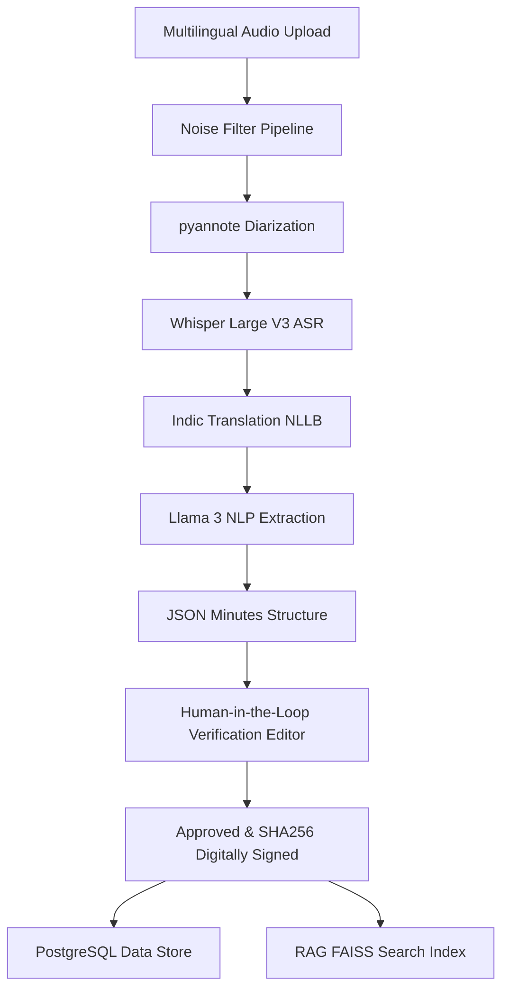

# Gram Sabha AI Minutes

Gram Sabha AI Minutes is a production-ready, AI-powered e-Governance platform designed to automate the documentation of local village assemblies (Gram Sabhas) in India. The application converts multilingual assembly audio into structured, searchable, translated, and legally auditable meeting minutes, featuring a human-in-the-loop review dashboard, demographic analytics, and a RAG-based AI retrieval chatbot.

---

## Technical Architecture

The platform is split into a modular backend and client codebase:



### Folder Structure

```
├── backend/
│   ├── app/
│   │   ├── core/           # Configs, DB sessions
│   │   ├── services/       # AI pipeline, RAG embeddings, Audit Hashing
│   │   ├── routers/        # Auth, Meetings, Attendance, Chat, Analytics, Audit
│   │   ├── models.py       # SQLAlchemy Schema
│   │   ├── schemas.py      # Pydantic Schemas
│   │   ├── main.py         # FastAPI Entrypoint
│   │   └── seed_data.py    # Database Seeder
│   ├── tests/              # API and RAG Pytests
│   ├── Dockerfile
│   └── requirements.txt
├── frontend/
│   ├── app/                # Next.js pages and layouts
│   ├── tailwind.config.js  # Premium Design Tokens
│   ├── next.config.js
│   ├── tsconfig.json
│   └── Dockerfile
├── docker-compose.yml      # Multi-container service definitions
└── README.md
```

---

## Core Features

1. **RBAC & Authentication**: Implements JSON Web Tokens (JWT) for secure roles: Citizens, Panchayat Secretaries, Sarpanch Moderators, District Officers, and Admins.
2. **Attendance Proximity (GPS + QR)**: Generates unique QR codes for sessions. Validates mobile check-ins with Haversine distance verification from the Panchayat Center.
3. **AI NLP Pipeline**: Extracts summary text, budget totals, action items, target deadlines, government schemes (e.g., Jal Jeevan Mission, Swachh Bharat), and voting splits from transcripts.
4. **Side-by-side Editor**: Allows Panchayat Secretaries to verify, edit, and adjust transcription text against minutes draft before final approval.
5. **Cryptographic SHA256 Ledger**: Finalizing minutes locks the state, computes a SHA256 digital signature hash, and writes an immutable record in the audit trail table.
6. **RAG Semantic Search Chatbot**: Employs Sentence Transformers and local similarity indexes to fetch past resolutions with citation details and confidence rankings.
7. **e-Panchayat Analytics Dashboard**: Beautiful visual metrics using Recharts displaying gender and SC/ST representation percentage, speaking time distribution, and budget splits.
8. **Multilingual Translation Integration**: Translate meeting summaries and transcript logs on-demand into Hindi (हिंदी), Marathi (मराठी), Telugu (తెలుగు), and English. Offers side-by-side translations in both the Moderator sign-off view and the public search registry.

---

## Recent Platform Enhancements

* **Strict Route Guards**: Integrated component-level role verification checking (RBAC) to block unauthorized navigation (e.g. restricting live recording views and dashboard quick-actions solely to Secretaries and Admins).
* **Class-Based Dark/Light Mode**: Bound theme toggling state to Tailwind's `class` dark mode engine, enabling instant dark-palette adjustments across all modules.
* **Layout Overflow Control**: Fixed scroll tracking behaviors in global CSS to prevent scrolling lockouts on smaller device resolutions.

---

## Getting Started (Docker Compose)

Ensure you have Docker and Docker Compose installed.

### 1. Launch the Stack
From the root project directory, run:
```bash
docker-compose up --build
```
This builds and starts:
- **PostgreSQL** on port `5432`
- **FastAPI Backend** on port `8000` (Swagger docs at `http://localhost:8000/docs`)
- **Next.js Frontend** on port `3000`

### 2. Seed the Database
Seed the PostgreSQL instance with sample Indic data (Hindi/Marathi/English logs) by executing:
```bash
docker-compose exec backend python app/seed_data.py
```

### 3. Open the App
Access `http://localhost:3000` in your web browser. 

---

## Verification & Testing

To run the local automated test suite overriding database setups to temp sqlite instances:
1. Initialize a Python virtual environment:
   ```bash
   cd backend
   python -m venv venv
   source venv/bin/activate
   pip install -r requirements.txt
   ```
2. Execute the test cases:
   ```bash
   pytest tests/test_api.py
   ```
