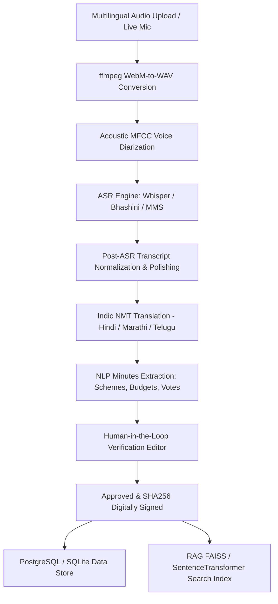

# Gram Sabha AI Minutes

Gram Sabha AI Minutes is a production-ready, AI-powered e-Governance platform designed to automate the documentation of local village assemblies (Gram Sabhas) in India. The application converts multilingual assembly audio into structured, searchable, translated, and legally auditable meeting minutes, featuring a human-in-the-loop review dashboard, demographic analytics, acoustic speaker diarization, and a RAG-based AI retrieval chatbot.

---

## Technical Architecture

The platform is split into a modular FastAPI backend and Next.js client codebase:


```mermaid
graph TD
    A[Multilingual Audio Upload / Live Mic] --> B[ffmpeg WebM-to-WAV Conversion]
    B --> C[Acoustic MFCC Voice Diarization]
    C --> D[ASR Engine: Whisper / Bhashini / MMS]
    D --> E[Post-ASR Transcript Normalization & Polishing]
    E --> F[Indic NMT Translation - Hindi / Marathi / Telugu]
    F --> G[NLP Minutes Extraction: Schemes, Budgets, Votes]
    G --> H[Human-in-the-Loop Verification Editor]
    H --> I[Approved & SHA256 Digitally Signed]
    I --> J[PostgreSQL / SQLite Data Store]
    I --> K[RAG FAISS / SentenceTransformer Search Index]
```

### Folder Structure

```
├── backend/
│   ├── app/
│   │   ├── core/           # Configs, DB sessions, Pydantic settings
│   │   ├── services/       # AI pipeline, Acoustic Diarization, Bhashini, RAG, Audit
│   │   ├── routers/        # Auth, Meetings, Audio, Attendance, Chat, Analytics, Audit, Translation
│   │   ├── models.py       # SQLAlchemy Schema definitions
│   │   ├── schemas.py      # Pydantic Schemas
│   │   ├── main.py         # FastAPI Entrypoint
│   │   └── seed_data.py    # Database Seeder
│   ├── tests/              # API and RAG Pytests
│   ├── Dockerfile
│   └── requirements.txt
├── frontend/
│   ├── app/                # Next.js App Router pages and layouts
│   │   ├── components/     # DevToolsProtector, AudioPlayer, Navbar, Modals
│   │   ├── record/         # Live Audio Recorder View
│   │   ├── verify/         # Side-by-side Human-in-the-Loop Editor
│   │   ├── public/         # Public Transparency Registry
│   │   └── analytics/      # Demographic & Budget Analytics
│   ├── tailwind.config.js  # Custom Tokens & Dark Mode Theme
│   ├── next.config.js      # Production Security Headers
│   ├── tsconfig.json
│   └── Dockerfile
├── docker-compose.yml      # Multi-container service definitions
└── README.md
```

---

## Core Features

1. **RBAC & HttpOnly Authentication**: Implements JSON Web Tokens (JWT) issued via secure HttpOnly cookies for Roles: Citizens, Panchayat Secretaries, Sarpanch Moderators, District Officers, and Admins.
2. **True Acoustic Voice Diarization**: Uses `librosa` to extract 20 Mel-Frequency Cepstral Coefficients (MFCCs) and `scikit-learn` Agglomerative Clustering on physical voice timbre, identifying physical speaker shifts independent of pauses.
3. **Multi-Engine ASR (Whisper / Bhashini / MMS)**: Transcribes audio using local `openai/whisper-small` or MeitY's official **Bhashini Dhruva ASR API** with fallback to Meta MMS-1B.
4. **Post-ASR Transcript Normalization & Polishing**: Automatically filters speech stutters, vocal fillers (`um`, `uh`, `matlab`, `yani`), restores proper punctuation, and normalizes grammar.
5. **Dynamic Indic NMT Translation**: Live neural machine translation of summaries, agendas, and diarized transcript segments into Hindi (हिंदी), Marathi (मराठी), Telugu (తెలుగు), and English.
6. **Attendance Proximity (GPS + QR)**: Validates mobile check-ins using Haversine formula distance verification from the Panchayat Center.
7. **AI Minutes Extraction**: Extracts summary text, budget totals, action items, target deadlines, government schemes (e.g., Jal Jeevan Mission, PMGSY, Swachh Bharat), and voting splits from transcripts.
8. **Side-by-side Verification Editor**: Allows Panchayat Secretaries to review, edit, and align transcript dialogue turns before final sign-off.
9. **Cryptographic SHA256 Ledger**: Locking finalized minutes computes an immutable SHA256 digital signature hash in the audit trail.
10. **RAG Semantic Search Chatbot**: Employs Sentence Transformers and vector similarity indexes to fetch past resolutions with exact citation details.
11. **e-Panchayat Analytics Dashboard**: Visual metrics displaying gender and SC/ST representation percentage, speaking time distribution, and budget splits.
12. **Client & Server Hardening**: Features client-side DevTools protection (`DevToolsProtector` blocking F12, inspect element, right clicks, and anti-debugging loops), CORS restrictions, and security HTTP headers (`HSTS`, `X-Frame-Options`, `X-Content-Type-Options`).

---

## Getting Started (Commands to Run)

### Option 1: Running Locally with Python & Node.js

#### 1. Backend Setup:
```bash
cd backend
python3 -m venv ../venv
source ../venv/bin/activate
pip install -r requirements.txt

# Run FastAPI server
DATABASE_URL=sqlite:///./gram_sabha.db uvicorn app.main:app --port 8000 --reload
```

#### 2. Frontend Setup:
```bash
cd frontend
npm install
npm run dev
```
Access the application at `http://localhost:3000`.

---

### Option 2: Running via Docker Compose

From the root project directory, run:
```bash
docker-compose up --build
```
This builds and launches:
- **PostgreSQL** on port `5432`
- **FastAPI Backend** on port `8000` (Swagger docs at `http://localhost:8000/docs`)
- **Next.js Frontend** on port `3000`

To seed sample Gram Sabha data:
```bash
docker-compose exec backend python app/seed_data.py
```

---

## Verification & Testing

To execute the automated test suite:
```bash
cd backend
pytest tests/test_api.py
```
